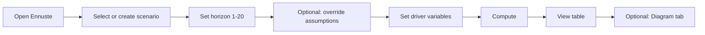

# Projection (Ennuste) UX plan

## Summary

- **Current state:** Budget tab (3-year sets), Revenue (Tulot), Projection (Ennuste) with scenario + base budget + horizon 3–20 years; global assumption overrides; result table (revenue, expenses, investments, net result, cumulative, water price, volume). No per-year or “% from year X” user input for vesi/jätevesi today.
- **Target:** 3-year history as base; 20-year projection; variables for **vesi** and **jätevesi**: yksikköhinta, myyty määrä — either **per-year** or **annual % change from year X**.

---

## Codex brainstorm prompt used

> We have a Finnish water-utility budget app with two main tabs: Tulot (revenue) and Ennuste (projection). History is 3 years of budgets; Ennuste projects up to 20 years. We want users to set variables per year or as annual % change from a chosen year X. Variables: at least vesi (yksikköhinta, myyty määrä) and jätevesi (same).  
> Brainstorm: (1) How would a typical user (finance/manager) want to use the projection screen step-by-step? (2) What should the projection view look like (layout, tables, controls)? (3) Should we add a separate Diagram tab for the projection (e.g. line charts for revenue, result, volume, price over years), and if so what should it show and how should it relate to the table? (4) Where should per-year vs %-from-year-X inputs live (same screen, tabs, or modal)?

(Model: gpt-5.3-codex.)

---

## UX recommendations (from Codex + plan)

### 1. User flow (step-by-step)

1. Open **Ennuste** tab.
2. Select or create a **scenario** (name + base budget). Base budget = last year of 3-year history (t0).
3. Set **horizon** (1–20 years; t0+1 … t0+n).
4. Optionally open **Assumptions** and override org defaults (inflaatio, energakerroin, vesimaaran_muutos, hintakorotus, investointikerroin).
5. Set **driver variables** for vesi and jätevesi:
   - **Per-year:** enter yksikköhinta and myyty määrä for specific years where needed.
   - **% from year X:** set start year X and annual % change; formula `arvo(y) = arvo(X) * (1 + p)^(y - X)` for y ≥ X+1.
6. Click **Compute** to run the projection.
7. View **table** (and optionally **Diagram** tab) for revenue, expenses, net result, cumulative, price, volume by year.

### 2. Layout

- **Top:** Scenario selector (tabs or dropdown), base budget label, horizon selector (e.g. 3 / 5 / 7 / 10 / 15 / 20 years), primary actions (Compare, Export CSV/PDF, Create scenario).
- **Middle:** Collapsible **Assumptions** panel (org default + overrides). Below it: **variable inputs** (DriverPlanner or equivalent) — same screen for both “per-year” and “% from year X” (e.g. toggle or tabs per driver: Vesi / Jätevesi, then per variable type).
- **Bottom:** **Compute** button, then **results**: table first; optional **Diagram** sub-tab next to table (e.g. “Taulukko” | “Diagrammi”) sharing the same scenario and horizon.

One primary action per block; clear hierarchy so the path is: choose scenario → set horizon & variables → compute → review table/diagram.

### 3. Diagram tab

- **Yes.** Add a **Diagram** (Chart) sub-view **within** the Ennuste page (not a new top-level tab).
- **Content:** Line charts over years: (1) revenue, (2) net result, (3) water price (vesi + jätevesi if both), (4) volume (myyty määrä). Optional: cumulative result as a line or area.
- **Relation to table:** Same data source as the year-by-year table; diagram is a visual summary. Selecting a year in the diagram could highlight the corresponding table row (optional).

### 4. Where variable inputs live

- **Same screen** (recommended): Keep per-year and “% from year X” on the same Ennuste view, in the middle section. Use a compact control per driver (Vesi / Jätevesi): e.g. toggle “Vuosikohtaiset arvot” vs “Vuosimuutos % vuodesta X”, then the relevant inputs (year grid vs start year + %). Avoid a modal so users see assumptions and variables in one flow without extra clicks.

### 5. UX principles (from Codex)

- **Progressive disclosure:** Essentials first (scenario, horizon, Compute); advanced options (assumptions, per-year overrides) available but not blocking.
- **Clear status:** “Last computed”, validation errors (e.g. missing base value for year X) inline.
- **Smart defaults:** Horizon and assumption defaults from org; driver rules can default to “% from base year” with a sensible % so first run gives a result quickly.

### 6. Validation rules (from Codex)

- Horizon only 1–20 years.
- “% from year X” requires a defined value for year X (base); block save/compute and show error if missing.
- Allow negative % only if it does not lead to negative price/volume without explicit confirmation or separate flag.

---

## User flow (mermaid)

---

## Implementation order (unchanged)

1. **Docs:** This file + any ADR/backlog refs.
2. **Data/API:** Schema and API for per-year and “from year X, %” overrides; integrate in projection engine.
3. **Ennuste UI:** Variable inputs (DriverPlanner or equivalent), then Diagram sub-tab with charts from projection result.
