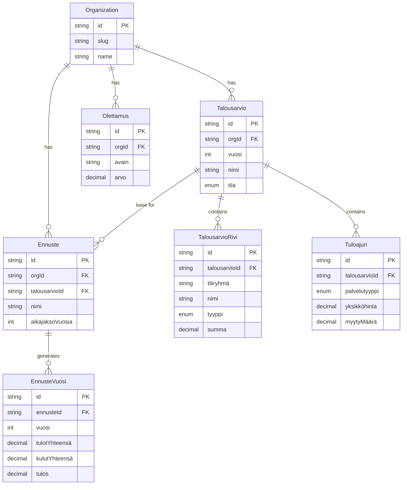

> ⚠️ **DEPRECATED / HISTORICAL**  
> Do not use as current spec. Canonical docs: [docs/CANONICAL.md](../CANONICAL.md). For architecture and API use: [ARCHITECTURE.md](../ARCHITECTURE.md), [API.md](../API.md).

---

# VA Budget Pivot Plan — Finland Vatten & Avlopp

Version: 1.0
Date: 2026-02-06
Status: Implementation plan (approved for execution)
Audience: Developer (Cursor), founder, domain expert

---

## 0. Executive Summary

### What is changing

Plan20 pivots from an **asset import / maintenance planning system** to a **Finland VA (vesihuolto) budgeting and projection system**.

The new product answers one question for small Finnish water utilities:

> "Given our budget, water price, and sold volume — are we financially sustainable, and can we prove it?"

Finnish water legislation increasingly requires utilities to demonstrate that tariffs (unit prices) cover costs and that budgets are transparent. Most small utilities have budgets but **lack the unit-price and volume data** needed to compute revenue. This system closes that gap.

### What remains

| Component | Status | Notes |
|-----------|--------|-------|
| Organization / multi-tenancy | **Kept as-is** | `Organization` model, `TenantGuard`, org-scoped data isolation |
| User / Role / UserRole | **Kept as-is** | JWT auth, bcrypt passwords, role-based access |
| Auth module (login, JWT, guards) | **Kept as-is** | `JwtAuthGuard`, `TenantGuard`, demo bypass |
| Demo mode (bootstrap + reset) | **Kept, rewritten seed data** | New demo data = realistic VA budget, not asset types |
| Health module | **Kept as-is** | Liveness/readiness probes unchanged |
| PlanningScenario model | **Replaced** | New `Ennuste` (projection/scenario) model supersedes it |
| Prisma + PostgreSQL | **Kept as-is** | Same DB, same ORM, new models added |
| React + Vite + custom CSS | **Kept as-is** | Same stack, new pages, i18n added |

### What gets deprecated/hidden

| Component | Action |
|-----------|--------|
| Asset, AssetType, Site, MaintenanceItem models | Feature-flagged; hidden from nav; no deletion |
| ExcelImport, ExcelSheet, ImportedRecord, ImportMapping, MappingColumn models | Feature-flagged; hidden from nav |
| Assets, Locations, Import tabs | Removed from default nav; available behind `LEGACY_ASSET_MODE=true` |
| Plan tab (ProjectionPage with OPEX/CAPEX) | Replaced entirely by new budget/projection views |
| All OPEX/CAPEX language in UI | Removed completely |
| 11 import-related API endpoints | Hidden behind feature flag |
| Asset/Site/AssetType/Maintenance endpoints | Hidden behind feature flag |

---

## 1. Product Definition

### 1.1 Primary User Personas

**VA-päällikkö (SV: VA-chef / EN: VA Manager)**
- Runs the water utility day-to-day
- Owns the budget process
- Needs to justify tariff levels to the board
- Typically 1 person per utility; may also be the bookkeeper in small orgs

**Kirjanpitäjä (SV: Bokförare / EN: Bookkeeper)**
- Prepares the budget from the accounting system
- Knows the account structure and historical numbers
- Enters or exports budget data
- Does not make tariff decisions but provides the numbers

**Hallituksen jäsen (SV: Styrelseledamot / EN: Board Member)**
- Reviews budget, projection, and compliance reports
- Needs clear, non-technical summaries
- Approves tariff changes
- Read-only access to projections and reports

### 1.2 Jobs-to-be-Done

| Job | Persona | Priority |
|-----|---------|----------|
| Input yearly budget by cost category | VA Manager, Bookkeeper | MVP |
| Set water unit price and sold volume | VA Manager | MVP |
| See computed revenue vs. budget costs | VA Manager, Board Member | MVP |
| Adjust assumptions (inflation, energy factor) and see impact | VA Manager | MVP |
| Compare baseline vs. alternative scenarios | VA Manager, Board Member | MVP |
| Export/print a compliance-ready summary | VA Manager, Board Member | MVP |
| Switch UI language (FI/SV/EN) | All | MVP |
| Import budget from structured export (later) | Bookkeeper | Phase 4 |

---

## 2. Domain Model

### 2.1 Entity Overview

All entities use Finnish terminology as primary. Format: **Suomeksi (SV: Svenska / EN: English)**.

```
Organization (existing)
  └── Talousarvio (SV: Budget / EN: Budget)         [yearly]
        ├── TalousarvioRivi (SV: Budgetrad / EN: BudgetLine)  [per account/category]
        └── Tuloajuri (SV: Intäktsdrivare / EN: RevenueDriver)
              ├── water price + volume
              └── wastewater price + volume
  └── Olettamus (SV: Antagande / EN: Assumption)    [inflation, energy, etc.]
  └── Ennuste (SV: Prognos / EN: Projection)        [scenario-based]
        └── EnnusteVuosi (SV: Prognosår / EN: ProjectionYear) [computed yearly output]
```

### 2.2 Entity Definitions

#### Organization (existing — no changes)

Reused from current schema. Fields unchanged:
- `id` (String, UUID, PK)
- `slug` (String, unique)
- `name` (String)
- `renewalStrategy` — legacy, nullable, ignored by new code
- `annualRenewalCapacityEur` — legacy, nullable, ignored by new code
- `created_at` (DateTime)

Relations: adds new relations to `Talousarvio`, `Olettamus`, `Ennuste`.

---

#### Talousarvio (SV: Budget / EN: Budget)

One per organization per year. The top-level budget container.

| Field | Type | Required | Notes |
|-------|------|----------|-------|
| `id` | String (UUID) | PK | |
| `orgId` | String (FK → Organization) | Yes | Tenant isolation |
| `vuosi` (SV: år / EN: year) | Int | Yes | Budget year, e.g. 2026 |
| `nimi` (SV: namn / EN: name) | String | No | Optional label, e.g. "Talousarvio 2026" |
| `tila` (SV: status / EN: status) | Enum: `luonnos`, `vahvistettu` | Yes | Draft / confirmed |
| `createdAt` | DateTime | Auto | |
| `updatedAt` | DateTime | Auto | |

Relations:
- `org` → Organization
- `rivit` → TalousarvioRivi[]
- `tuloajurit` → Tuloajuri[]

Constraints:
- `@@unique([orgId, vuosi])` — one budget per org per year

Enum `TalousarvioTila`:
- `luonnos` (SV: utkast / EN: draft)
- `vahvistettu` (SV: fastställd / EN: confirmed)

---

#### TalousarvioRivi (SV: Budgetrad / EN: BudgetLine)

Individual cost/revenue line within a budget. Aligned with Finnish VA accounting practice.

| Field | Type | Required | Notes |
|-------|------|----------|-------|
| `id` | String (UUID) | PK | |
| `talousarvioId` | String (FK → Talousarvio) | Yes | Parent budget |
| `tiliryhmä` (SV: kontogrupp / EN: accountGroup) | String | Yes | Account group code, e.g. "4000" |
| `nimi` (SV: namn / EN: name) | String | Yes | Line description, e.g. "Energiakustannukset" |
| `tyyppi` (SV: typ / EN: type) | Enum: `kulu`, `tulo`, `investointi` | Yes | Cost / Revenue / Investment |
| `summa` (SV: belopp / EN: amount) | Decimal | Yes | Amount in EUR (positive always; sign from `tyyppi`) |
| `muistiinpanot` (SV: anteckningar / EN: notes) | String | No | Free-text notes |
| `createdAt` | DateTime | Auto | |
| `updatedAt` | DateTime | Auto | |

Relations:
- `talousarvio` → Talousarvio (cascade delete)

Enum `RiviTyyppi`:
- `kulu` (SV: kostnad / EN: expense)
- `tulo` (SV: intäkt / EN: revenue)
- `investointi` (SV: investering / EN: investment)

Constraints:
- `@@index([talousarvioId])` for query performance

---

#### Tuloajuri (SV: Intäktsdrivare / EN: RevenueDriver)

Captures the unit-price and volume data that budgets typically lack. This is the compliance-critical addition.

| Field | Type | Required | Notes |
|-------|------|----------|-------|
| `id` | String (UUID) | PK | |
| `talousarvioId` | String (FK → Talousarvio) | Yes | Parent budget |
| `palvelutyyppi` (SV: tjänstetyp / EN: serviceType) | Enum: `vesi`, `jätevesi`, `muu` | Yes | Water / wastewater / other |
| `yksikköhinta` (SV: enhetspris / EN: unitPrice) | Decimal | Yes | EUR per m³ (excl. VAT) |
| `myytyMäärä` (SV: såld volym / EN: soldVolume) | Decimal | Yes | m³ sold per year |
| `perusmaksu` (SV: grundavgift / EN: baseFee) | Decimal | No | Fixed annual fee per connection (if applicable) |
| `liittymämäärä` (SV: antal anslutningar / EN: connectionCount) | Int | No | Number of connections (for base fee calc) |
| `alvProsentti` (SV: momsprocent / EN: vatPercent) | Decimal | No | VAT rate; default assumption 24% |
| `muistiinpanot` | String | No | Notes |
| `createdAt` | DateTime | Auto | |
| `updatedAt` | DateTime | Auto | |

Relations:
- `talousarvio` → Talousarvio (cascade delete)

Computed (API-level, not stored):
- `liikevaihto` (SV: omsättning / EN: revenue) = `yksikköhinta × myytyMäärä`
- `perusmaksutulo` (EN: baseFeeRevenue) = `perusmaksu × liittymämäärä`
- `kokonaistulo` (EN: totalRevenue) = `liikevaihto + perusmaksutulo`
- `kokonaistulo_alv` (EN: totalRevenueInclVat) = `kokonaistulo × (1 + alvProsentti/100)`

Enum `Palvelutyyppi`:
- `vesi` (SV: vatten / EN: water)
- `jätevesi` (SV: avloppsvatten / EN: wastewater)
- `muu` (SV: övrigt / EN: other)

---

#### Olettamus (SV: Antagande / EN: Assumption)

Global assumptions for an organization. Used by the projection engine. Each assumption is a named key-value pair so the set is extensible.

| Field | Type | Required | Notes |
|-------|------|----------|-------|
| `id` | String (UUID) | PK | |
| `orgId` | String (FK → Organization) | Yes | Tenant isolation |
| `avain` (SV: nyckel / EN: key) | String | Yes | Machine key, e.g. `inflaatio`, `energiakerroin` |
| `nimi` (SV: namn / EN: name) | String | Yes | Human-readable, e.g. "Inflaatio-olettamus" |
| `arvo` (SV: värde / EN: value) | Decimal | Yes | Numeric value, e.g. 0.025 for 2.5% |
| `yksikkö` (SV: enhet / EN: unit) | String | No | Display unit, e.g. "%", "kerroin" |
| `kuvaus` (SV: beskrivning / EN: description) | String | No | Explanation of what this assumption means |
| `createdAt` | DateTime | Auto | |
| `updatedAt` | DateTime | Auto | |

Relations:
- `org` → Organization

Constraints:
- `@@unique([orgId, avain])` — one value per key per org

Default assumptions seeded for new orgs / demo:

| Key (`avain`) | Default `arvo` | Description |
|---------------|----------------|-------------|
| `inflaatio` (SV: inflation / EN: inflation) | 0.025 | General inflation rate (2.5%) |
| `energiakerroin` (SV: energifaktor / EN: energyFactor) | 0.05 | Energy cost annual increase (5%) |
| `vesimääränMuutos` (SV: volymförändring / EN: volumeChange) | -0.01 | Sold volume annual change (-1%) |
| `hintakorotus` (SV: prishöjning / EN: priceIncrease) | 0.03 | Unit price annual increase (3%) |
| `investointikerroin` (SV: investeringsfaktor / EN: investmentFactor) | 0.02 | Investment cost annual increase (2%) |

---

#### Ennuste (SV: Prognos / EN: Projection)

A named scenario that generates multi-year projections from a base budget + assumptions.

| Field | Type | Required | Notes |
|-------|------|----------|-------|
| `id` | String (UUID) | PK | |
| `orgId` | String (FK → Organization) | Yes | Tenant isolation |
| `talousarvioId` | String (FK → Talousarvio) | Yes | Base budget for projection |
| `nimi` (SV: namn / EN: name) | String | Yes | e.g. "Perusskenaario 2026-2030" |
| `aikajaksoVuosia` (SV: periodÅr / EN: horizonYears) | Int | Yes | Default 5; max 20 |
| `olettamusYlikirjoitukset` (SV: antagandeöverskrivningar / EN: assumptionOverrides) | Json | No | Per-scenario overrides: `{ "inflaatio": 0.03 }` |
| `onOletus` (SV: ärStandard / EN: isDefault) | Boolean | No | Default scenario flag |
| `createdAt` | DateTime | Auto | |
| `updatedAt` | DateTime | Auto | |

Relations:
- `org` → Organization
- `talousarvio` → Talousarvio
- `vuodet` → EnnusteVuosi[]

Constraints:
- `@@unique([orgId, nimi])` — unique scenario name per org

---

#### EnnusteVuosi (SV: Prognosår / EN: ProjectionYear)

Computed output row for each year in a projection. Stored after computation for export/display.

| Field | Type | Required | Notes |
|-------|------|----------|-------|
| `id` | String (UUID) | PK | |
| `ennusteId` | String (FK → Ennuste) | Yes | Parent projection |
| `vuosi` (SV: år / EN: year) | Int | Yes | Calendar year |
| `tulotYhteensä` (SV: intäkterTotalt / EN: totalRevenue) | Decimal | Yes | Projected revenue |
| `kulutYhteensä` (SV: kostnaderTotalt / EN: totalExpenses) | Decimal | Yes | Projected expenses |
| `investoinnitYhteensä` (SV: investeringarTotalt / EN: totalInvestments) | Decimal | Yes | Projected investments |
| `tulos` (SV: resultat / EN: netResult) | Decimal | Yes | Revenue - expenses - investments |
| `kumulatiivinenTulos` (SV: kumulativtResultat / EN: cumulativeResult) | Decimal | Yes | Running total |
| `vesihinta` (SV: vattenpris / EN: waterPrice) | Decimal | No | Projected unit price that year |
| `myytyVesimäärä` (SV: såldVolym / EN: soldVolume) | Decimal | No | Projected volume that year |
| `erittelyt` (SV: specifikationer / EN: breakdown) | Json | No | Detailed line-by-line breakdown |

Relations:
- `ennuste` → Ennuste (cascade delete)

Constraints:
- `@@unique([ennusteId, vuosi])`

---

### 2.3 Entity Relationship Diagram



---

## 3. Data Entry & Import Strategy

### 3.1 MVP: Manual Entry First

The MVP requires **no file import**. All data is entered manually through the UI.

**Minimum required inputs to compute revenue:**

| Input | Where entered | Why required |
|-------|---------------|--------------|
| Budget year | Budget creation | Scoping |
| Budget lines (account group + amount) | Budget view | Cost base |
| Water unit price (EUR/m³) | Revenue driver form | Revenue = price × volume |
| Sold water volume (m³/year) | Revenue driver form | Revenue = price × volume |
| Wastewater unit price (EUR/m³) | Revenue driver form | Same, for wastewater |
| Sold wastewater volume (m³/year) | Revenue driver form | Same, for wastewater |

**Optional but recommended:**
- Base fee per connection + connection count
- VAT percentage (default: 24%)
- Assumption overrides per scenario

### 3.2 Granularity: Budget Level, Not Line-Item Level

Per domain expert guidance: "budgetnivån kan vara för noggrann" — budgets can be overly detailed.

Strategy:
- Budget lines are at **account group level** (e.g., "4000 Materials", "5000 Energy"), not individual transactions
- A utility with 5-15 cost categories is normal
- The system should pre-populate suggested account groups based on Finnish VA practice but allow free-form entry
- Revenue is **not** a budget line — it is computed from revenue drivers (unit price × volume)

### 3.3 Suggested Default Account Groups

Pre-populated when creating a new budget (user can add/remove/rename):

| Code | FI Name | SV Name | EN Name | Type |
|------|---------|---------|---------|------|
| 3000 | Vesimaksut (laskettu) | Vattenavgifter (beräknad) | Water fees (computed) | tulo |
| 3100 | Jätevesimaksut (laskettu) | Avloppsavgifter (beräknad) | Wastewater fees (computed) | tulo |
| 3200 | Liittymismaksut | Anslutningsavgifter | Connection fees | tulo |
| 3900 | Muut tulot | Övriga intäkter | Other revenue | tulo |
| 4000 | Materiaalit ja tarvikkeet | Material och förnödenheter | Materials and supplies | kulu |
| 4100 | Henkilöstökulut | Personalkostnader | Personnel costs | kulu |
| 4200 | Energiakustannukset | Energikostnader | Energy costs | kulu |
| 4300 | Ulkopuoliset palvelut | Externa tjänster | External services | kulu |
| 4400 | Vuokrat ja kiinteistökulut | Hyror och fastighetskostn. | Rent and property costs | kulu |
| 4500 | Hallinto ja vakuutukset | Administration och försäkr. | Admin and insurance | kulu |
| 4600 | Poistot | Avskrivningar | Depreciation | kulu |
| 4900 | Muut kulut | Övriga kostnader | Other expenses | kulu |
| 5000 | Verkostoinvestoinnit | Nätverksinvesteringar | Network investments | investointi |
| 5100 | Laitosinvestoinnit | Verkinvesteringar | Plant investments | investointi |
| 5900 | Muut investoinnit | Övriga investeringar | Other investments | investointi |

**ASSUMPTION**: These account groups are based on typical Finnish VA accounting. The exact mapping to official kirjanpitoasetus categories should be validated with domain expert. Marked as open question (Section 10).

### 3.4 Future Import Path (Phase 4)

When structured budget exports become available (e.g., from Tikon, Econet, or similar accounting systems):

1. User uploads a CSV/Excel export
2. System detects column headers and maps to `tiliryhmä` + `summa`
3. Existing `ImportMapping` infrastructure can be adapted (column mapping + template reuse)
4. No OCR required — accounting systems export structured data
5. Kronby/Terjärv PDFs serve as vocabulary/structure reference only; not ingested

The existing `ExcelImport` / `ImportMapping` pipeline is over-engineered for this use case but the column-mapping concept transfers. Phase 4 builds a simpler budget-specific importer.

---

## 4. UI/UX Flow

### 4.1 Navigation Structure (New)

Replace current tabs entirely. New tab structure in `Layout.tsx`:

| Tab | FI Label | SV Label | EN Label | Page Component |
|-----|----------|----------|----------|----------------|
| Budget | Talousarvio | Budget | Budget | `BudgetPage` |
| Revenue | Tulot | Intäkter | Revenue | `RevenuePage` |
| Projection | Ennuste | Prognos | Projection | `ProjectionPage` (new) |
| Settings | Asetukset | Inställningar | Settings | `SettingsPage` |

Header additions:
- **Language switcher** (right side of header): dropdown or button group for FI / SV / EN
- App title changes from "Asset Maintenance" to "VA-talous" (SV: VA-ekonomi / EN: VA Finance)

### 4.2 First-Time Setup Flow

When an org has no budgets, show a setup wizard instead of empty pages.

**Step 1: Organization basics** (if not already set)
- Confirm org name
- Choose primary language (sets default; can switch anytime)

**Step 2: Create first budget**
- Select year (default: current year)
- Pre-populate default account groups (Section 3.3)
- User adjusts amounts

**Step 3: Set revenue drivers**
- Water: unit price + volume
- Wastewater: unit price + volume
- Optional: base fee + connections
- System immediately shows computed revenue total

**Step 4: Review**
- Summary: total costs, total revenue, surplus/deficit
- "Looks right? → Go to dashboard" or "Edit more"

The wizard is **not** a blocking gate — user can skip any step and fill in later. Empty fields show gentle prompts ("Lisää vesihinta tulojen laskemiseksi" / "Add water price to calculate revenue").

### 4.3 Budget View (Main Screen)

Primary working screen. Shows the budget for the selected year.

Layout:
```
┌──────────────────────────────────────────────────┐
│ [Talousarvio 2026 ▼]   [Tila: Luonnos]          │
├──────────────────────────────────────────────────┤
│                                                  │
│  TULOT (Revenue)                                 │
│  ┌──────────────────────────────────────────┐    │
│  │ Vesimaksut          €XXX,XXX  (laskettu) │    │
│  │ Jätevesimaksut      €XXX,XXX  (laskettu) │    │
│  │ Liittymismaksut     €XX,XXX   [edit]     │    │
│  │ Muut tulot          €X,XXX    [edit]     │    │
│  │ ─────────────────────────────            │    │
│  │ TULOT YHTEENSÄ      €XXX,XXX            │    │
│  └──────────────────────────────────────────┘    │
│                                                  │
│  KULUT (Expenses)                                │
│  ┌──────────────────────────────────────────┐    │
│  │ Henkilöstökulut     €XX,XXX   [edit]     │    │
│  │ Energiakustannukset €XX,XXX   [edit]     │    │
│  │ ...                                      │    │
│  │ ─────────────────────────────            │    │
│  │ KULUT YHTEENSÄ      €XXX,XXX            │    │
│  └──────────────────────────────────────────┘    │
│                                                  │
│  INVESTOINNIT (Investments)                      │
│  ┌──────────────────────────────────────────┐    │
│  │ Verkostoinvestoinnit €XX,XXX  [edit]     │    │
│  │ ...                                      │    │
│  │ INVESTOINNIT YHT.   €XX,XXX             │    │
│  └──────────────────────────────────────────┘    │
│                                                  │
│  ══════════════════════════════════               │
│  TULOS (Result): €+XX,XXX  ✓ Ylijäämä           │
│                                                  │
└──────────────────────────────────────────────────┘
```

Key behaviors:
- Revenue lines marked "(laskettu)" / "(computed)" are derived from revenue drivers and not directly editable here — clicking opens the Revenue tab
- Expense and investment lines are inline-editable (click amount to edit)
- "Add line" button at the bottom of each section
- Year selector dropdown at top
- Status indicator: `Luonnos` / `Vahvistettu`
- Bottom summary shows surplus (`ylijäämä`) or deficit (`alijäämä`) with color coding

### 4.4 Revenue Tab

Dedicated screen for revenue driver inputs. This is where the compliance-critical data lives.

Layout:
```
┌──────────────────────────────────────────────────┐
│  VESI (Water)                                    │
│  Yksikköhinta:  [___] EUR/m³                     │
│  Myyty määrä:   [___] m³/vuosi                   │
│  → Liikevaihto: €XXX,XXX                         │
│                                                  │
│  Perusmaksu:    [___] EUR/liittymä (valinnainen) │
│  Liittymät:     [___] kpl                        │
│  → Perusmaksutulo: €XX,XXX                       │
├──────────────────────────────────────────────────┤
│  JÄTEVESI (Wastewater)                           │
│  Yksikköhinta:  [___] EUR/m³                     │
│  Myyty määrä:   [___] m³/vuosi                   │
│  → Liikevaihto: €XXX,XXX                         │
│                                                  │
│  Perusmaksu:    [___] EUR/liittymä (valinnainen) │
│  Liittymät:     [___] kpl                        │
│  → Perusmaksutulo: €XX,XXX                       │
├──────────────────────────────────────────────────┤
│  ALV: [24] %  (muutettavissa)                    │
│                                                  │
│  KOKONAISTULOT: €XXX,XXX (alv 0%)               │
│  KOKONAISTULOT: €XXX,XXX (sis. alv)             │
└──────────────────────────────────────────────────┘
```

Revenue is computed live as user types. No save button needed — auto-save with debounce.

### 4.5 Projection Tab (Replaces Old Plan Tab)

Shows multi-year projection based on base budget + assumptions.

Sections:
1. **Scenario selector** — dropdown to pick or create scenarios
2. **Assumptions panel** — editable assumption values (collapsible)
   - Shows org defaults; scenario overrides highlighted
3. **Projection table** — year-by-year: revenue, expenses, investments, net result, cumulative
4. **Summary insight** — traffic-light verdict: sustainable / tight / unsustainable
5. **Export button** — CSV or PDF

No OPEX/CAPEX terminology. Columns are:
- Vuosi (Year)
- Tulot (Revenue)
- Kulut (Expenses)
- Investoinnit (Investments)
- Tulos (Net result)
- Kumulatiivinen (Cumulative)

### 4.6 Settings Tab

- Organization name
- Default assumptions (with reset-to-defaults option)
- Language preference (also accessible from header switcher)
- Demo reset button (demo mode only)

### 4.7 Copy Guidelines

- **No tech talk**: No "entities", "models", "CRUD", "API"
- **No OPEX/CAPEX**: Use "kulut" (expenses), "investoinnit" (investments), "tulot" (revenue)
- **Finnish first**: All UI labels in the selected language; Finnish as system default
- **Explain revenue**: Where computed values appear, show the formula: "Vesimaksut = yksikköhinta × myyty määrä" in a tooltip or helper text
- **Encourage completeness**: Empty fields show soft prompts, not errors. Example: "Lisää jäteveden hinta kattavamman kuvan saamiseksi" (Add wastewater price for a more complete picture)

### 4.8 Preventing Users Getting Stuck

- Default account groups pre-populated — user starts with a non-blank form
- Revenue drivers: if only water price is set but not volume, show the price but grey out computed revenue with hint text
- Assumptions have sensible defaults (Section 2.2) — projection works immediately without manual assumption entry
- Year picker defaults to current year
- Setup wizard is skippable, every step optional

---

## 5. Backend / API Plan

### 5.1 New Modules and Endpoints

All new modules follow existing NestJS conventions: module + controller + service + DTOs in `src/<module>/`.

#### Budgets Module (`src/budgets/`)

| Method | Path | Description |
|--------|------|-------------|
| `GET /budgets` | List budgets for org | Query: `?vuosi=2026` |
| `POST /budgets` | Create budget | Body: `{ vuosi, nimi? }` |
| `GET /budgets/:id` | Get budget with lines and revenue drivers | |
| `PATCH /budgets/:id` | Update budget metadata | Body: `{ nimi?, tila? }` |
| `DELETE /budgets/:id` | Delete budget (cascade lines + drivers) | |
| `POST /budgets/:id/rivit` | Add budget line | Body: `{ tiliryhmä, nimi, tyyppi, summa }` |
| `PATCH /budgets/:id/rivit/:riviId` | Update budget line | |
| `DELETE /budgets/:id/rivit/:riviId` | Delete budget line | |
| `POST /budgets/:id/tuloajurit` | Add/update revenue driver | Body: `{ palvelutyyppi, yksikköhinta, myytyMäärä, ... }` |
| `PATCH /budgets/:id/tuloajurit/:ajuriId` | Update revenue driver | |
| `DELETE /budgets/:id/tuloajurit/:ajuriId` | Delete revenue driver | |

All endpoints require JWT + TenantGuard (existing guards, zero changes needed).

#### Assumptions Module (`src/assumptions/`)

| Method | Path | Description |
|--------|------|-------------|
| `GET /assumptions` | List all assumptions for org | |
| `PUT /assumptions/:avain` | Upsert assumption by key | Body: `{ arvo, nimi?, kuvaus? }` |
| `POST /assumptions/reset-defaults` | Reset to default assumptions | |

#### Projections Module (`src/projections/`)

| Method | Path | Description |
|--------|------|-------------|
| `GET /projections` | List projections for org | |
| `POST /projections` | Create projection/scenario | Body: `{ talousarvioId, nimi, aikajaksoVuosia, olettamusYlikirjoitukset? }` |
| `GET /projections/:id` | Get projection with computed years | |
| `PATCH /projections/:id` | Update projection params | |
| `DELETE /projections/:id` | Delete projection | |
| `POST /projections/:id/compute` | Recompute projection years | Returns computed `EnnusteVuosi[]` |
| `GET /projections/:id/export` | Export as CSV | Query: `?format=csv` |

### 5.2 Projection Computation Logic

The `POST /projections/:id/compute` endpoint:

1. Load base budget (lines + revenue drivers)
2. Load org assumptions; apply scenario overrides
3. For each year in horizon:
   - **Revenue**: base revenue × (1 + `hintakorotus`)^n × volume adjustment
     - Volume adjustment: base volume × (1 + `vesimääränMuutos`)^n
   - **Expenses**: for each budget line of type `kulu`:
     - Energy lines: amount × (1 + `energiakerroin`)^n
     - Other lines: amount × (1 + `inflaatio`)^n
   - **Investments**: amount × (1 + `investointikerroin`)^n
   - **Net result**: revenue - expenses - investments
   - **Cumulative**: running sum of net results
4. Upsert `EnnusteVuosi` rows
5. Return full projection

### 5.3 Auth / Tenant Guard Reuse

Zero changes needed. Existing infrastructure:
- `JwtAuthGuard` on all new endpoints
- `TenantGuard` extracts `orgId` from JWT, sets `req.orgId`
- All new services accept `orgId` parameter; all queries filter by it
- Demo mode bypass works as-is (synthetic demo user with `DEMO_ORG_ID`)

### 5.4 Demo Mode Updates

**Demo bootstrap** (`src/demo/demo-bootstrap.service.ts`):
- Replaces asset type seeding with budget demo data
- Creates a sample budget for current year with realistic Finnish VA numbers
- Seeds revenue drivers (example: water €1.80/m³, 150,000 m³; wastewater €2.40/m³, 140,000 m³)
- Seeds default assumptions
- Creates one default projection scenario

**Demo reset** (`src/demo/demo-reset.service.ts`):
- Add deletion of new entities: EnnusteVuosi, Ennuste, Tuloajuri, TalousarvioRivi, Talousarvio, Olettamus
- Keep deletion of legacy entities behind feature flag check
- Recreate demo budget data (not asset types)

### 5.5 Feature Flag Strategy

Environment variable: `LEGACY_ASSET_MODE=true|false` (default: `false`)

When `false`:
- Asset, Site, AssetType, Maintenance, Import, Mapping endpoints return 404
- Nav tabs for assets/locations/import are hidden
- Legacy models remain in DB but are not exposed

When `true`:
- All legacy endpoints active alongside new ones
- Both old and new nav tabs visible (useful during transition)

Implementation: a `LegacyGuard` that checks the env var and rejects requests to legacy controllers when disabled.

---

## 6. Database / Prisma Migration Plan

### 6.1 Models That Stay (Unchanged)

- `Organization` — add new relations only
- `User` — no changes
- `Role` — no changes
- `UserRole` — no changes

### 6.2 Models That Become Legacy

Not deleted, not modified. Marked with comments in schema. Feature-flagged at API level.

- `Site`
- `AssetType`
- `Asset`
- `MaintenanceItem`
- `PlanningScenario`
- `ExcelImport`
- `ExcelSheet`
- `ImportedRecord`
- `ImportMapping`
- `MappingColumn`

All 8 legacy enums remain in schema (`AssetStatus`, `Criticality`, `MaintenanceKind`, `RenewalStrategy`, `ImportStatus`, `TargetEntity`, `FieldCriticality`, `ImportAction`).

### 6.3 New Models to Add

Added in a single migration:

1. Enum `TalousarvioTila` (`luonnos`, `vahvistettu`)
2. Enum `RiviTyyppi` (`kulu`, `tulo`, `investointi`)
3. Enum `Palvelutyyppi` (`vesi`, `jätevesi`, `muu`)
4. Model `Talousarvio`
5. Model `TalousarvioRivi`
6. Model `Tuloajuri`
7. Model `Olettamus`
8. Model `Ennuste`
9. Model `EnnusteVuosi`

### 6.4 Migration Sequence

**Migration 1: `add_va_budget_models`**
- Create all 3 new enums
- Create all 6 new models
- Add relations from Organization to new models
- Add indexes and unique constraints

This is a single additive migration — no existing tables are modified (except Organization getting new relation fields, which are virtual in Prisma and don't change the DB column).

**No data migration needed** — this is greenfield. No existing data to transform.

### 6.5 Seed Strategy

Update `prisma/seed.ts`:

```
1. Create demo org "Plan20 Demo" (slug: plan20-demo) — UNCHANGED
2. Create ADMIN role — UNCHANGED
3. Create admin user (admin@plan20.dev) — UNCHANGED
4. NEW: Create default assumptions (5 keys from Section 2.2)
5. NEW: Create sample budget (year: current year)
   - 12 budget lines with realistic Finnish VA amounts
   - 2 revenue drivers (water + wastewater)
6. NEW: Create default projection (5-year horizon)
7. KEEP (behind flag): Create asset types IF LEGACY_ASSET_MODE
```

Demo budget amounts (realistic for a ~3000-connection Finnish utility):

| Line | Amount EUR |
|------|-----------|
| Henkilöstökulut | 120,000 |
| Energiakustannukset | 85,000 |
| Materiaalit ja tarvikkeet | 35,000 |
| Ulkopuoliset palvelut | 45,000 |
| Hallinto ja vakuutukset | 25,000 |
| Poistot | 90,000 |
| Muut kulut | 15,000 |
| Verkostoinvestoinnit | 150,000 |
| Laitosinvestoinnit | 50,000 |
| **Water**: €1.80/m³ × 160,000 m³ = €288,000 | |
| **Wastewater**: €2.40/m³ × 145,000 m³ = €348,000 | |
| **Total revenue**: ~€636,000 | |
| **Total expenses**: ~€415,000 | |
| **Total investments**: ~€200,000 | |
| **Net result**: ~€21,000 surplus | |

---

## 7. Reporting & Compliance Outputs

### 7.1 What the Law Implicitly Requires

Finnish water services act (vesihuoltolaki) and its upcoming amendments require utilities to demonstrate:

1. **Tariff transparency**: unit prices are known and publicly justified
2. **Cost coverage**: revenue from tariffs covers operating costs
3. **Long-term sustainability**: investments are planned and funded

Plan20 addresses this by producing:

### 7.2 Revenue Breakdown Report

Shows how revenue is computed:

```
TULOERITTELY (Revenue Breakdown) — 2026

Vesi (Water):
  Yksikköhinta:  1,80 EUR/m³
  Myyty määrä:   160 000 m³
  Liikevaihto:   288 000 EUR

Jätevesi (Wastewater):
  Yksikköhinta:  2,40 EUR/m³
  Myyty määrä:   145 000 m³
  Liikevaihto:   348 000 EUR

Perusmaksut:     12 000 EUR
Muut tulot:       5 000 EUR

TULOT YHTEENSÄ:  653 000 EUR
ALV (24%):       156 720 EUR
```

This report directly satisfies the requirement for **unit prices** and **sold volumes** in budget documentation.

### 7.3 Budget vs. Projection Comparison

Side-by-side view:

| | Talousarvio 2026 | Ennuste 2027 | Ennuste 2028 | ... |
|---|---|---|---|---|
| Tulot | 653,000 | 670,000 | 688,000 | |
| Kulut | 415,000 | 428,000 | 441,000 | |
| Investoinnit | 200,000 | 204,000 | 208,000 | |
| Tulos | +38,000 | +38,000 | +39,000 | |

### 7.4 Scenario Comparison

Multiple projections compared:

| | Perusskenaario | Korkea inflaatio | Matalampi hinta |
|---|---|---|---|
| Tulos 2028 | +39,000 | +22,000 | -5,000 |
| Kumulatiivinen 2030 | +195,000 | +98,000 | -42,000 |

Color-coded: green (surplus), yellow (tight), red (deficit).

### 7.5 Export Formats (MVP)

- **CSV**: all projection data in tabular format (reuse existing CSV export pattern from `ProjectionPage`)
- **Print-friendly view**: CSS print stylesheet for the projection page; board members print to PDF from browser

### 7.6 Compliance TODOs for Domain Expert

| Question | Context | Status |
|----------|---------|--------|
| Does Finnish law specify exact report format? | If yes, we must match it | TODO: Ask domain expert |
| Is VAT handling (alv) required in reports or just net? | Affects display | TODO: Confirm with expert |
| Are depreciation (poistot) rules prescribed? | Affects budget line structure | TODO: Ask domain expert |
| Must projections be signed/locked for audit? | Affects `tila` workflow | TODO: Clarify |

---

## 8. Step-by-Step Implementation Plan

### Phase 1: Foundation (i18n + navigation + new Prisma models)

**PR 1.1: Add i18n infrastructure**
- Install `react-i18next` + `i18next` in `apps/web`
- Create translation files: `public/locales/fi.json`, `sv.json`, `en.json`
- Create `I18nProvider` wrapper in `App.tsx`
- Add language switcher component to `Layout.tsx` header (right side)
- Migrate existing hardcoded strings in `Layout.tsx` and `App.tsx` to translation keys
- Files: `apps/web/package.json`, `apps/web/src/i18n/`, `apps/web/src/components/Layout.tsx`, `apps/web/src/App.tsx`, `apps/web/public/locales/*.json`
- Risk: Translation key sprawl. Mitigation: establish naming convention early (`page.section.label`)
- Test: Language switcher toggles all visible text; page reload preserves language choice (localStorage)

**PR 1.2: New Prisma models + migration**
- Add new enums and 6 new models to `schema.prisma`
- Mark legacy models with `// LEGACY` comments
- Run `prisma migrate dev` to create migration
- Add Organization relations to new models
- Files: `apps/api/prisma/schema.prisma`, `apps/api/prisma/migrations/YYYYMMDD_add_va_budget_models/`
- Risk: Field names with special characters (ä, ö). Mitigation: use ASCII-safe column names in `@map()` directives; keep Finnish names as Prisma field names
- Test: `prisma migrate deploy` succeeds; `prisma generate` produces correct types

**PR 1.3: New navigation + page scaffolds**
- Replace tab definitions in `Layout.tsx`: Budget / Revenue / Projection / Settings
- Create empty page components: `BudgetPage.tsx`, `RevenuePage.tsx`, `ProjectionPage.tsx` (new), `SettingsPage.tsx`
- Update `NavigationContext.tsx` with new tab IDs
- Add feature flag check: if `LEGACY_ASSET_MODE`, show old tabs too
- Remove "Asset Maintenance" title; replace with translated app name
- Files: `apps/web/src/components/Layout.tsx`, `apps/web/src/context/NavigationContext.tsx`, `apps/web/src/pages/BudgetPage.tsx`, `apps/web/src/pages/RevenuePage.tsx`, `apps/web/src/pages/SettingsPage.tsx`, `apps/web/src/App.tsx`
- Risk: Old pages still imported but not shown. Mitigation: lazy-load behind flag
- Test: New tabs visible; switching works; old tabs hidden by default

**PR 1.4: Update demo bootstrap + seed**
- Update `demo-bootstrap.service.ts` to seed budget data
- Update `demo-reset.service.ts` to clear new entities
- Update `prisma/seed.ts` with new demo data
- Files: `apps/api/src/demo/demo-bootstrap.service.ts`, `apps/api/src/demo/demo-reset.service.ts`, `apps/api/prisma/seed.ts`
- Risk: Demo reset must handle both old and new entities. Mitigation: delete new entities first, then old (if flag enabled)
- Test: Demo login shows seeded budget; demo reset clears and re-seeds correctly

---

### Phase 2: Budget Input + Revenue Drivers + Baseline Projection

**PR 2.1: Budgets API module**
- Create `src/budgets/` NestJS module: controller, service, DTOs
- CRUD for `Talousarvio` and `TalousarvioRivi`
- Revenue driver CRUD on budget sub-resource
- All endpoints guarded by JWT + Tenant
- Files: `apps/api/src/budgets/budgets.module.ts`, `budgets.controller.ts`, `budgets.service.ts`, `dto/`
- Test: Integration tests with Prisma test database; CRUD operations; tenant isolation verified

**PR 2.2: Assumptions API module**
- Create `src/assumptions/` NestJS module
- Upsert by key; reset-to-defaults endpoint
- Seed defaults on org creation
- Files: `apps/api/src/assumptions/`
- Test: Upsert creates/updates correctly; reset restores defaults; tenant isolation

**PR 2.3: Budget page UI**
- Implement `BudgetPage.tsx` with grouped line display (revenue/expenses/investments)
- Inline editing for amounts
- Add/remove budget lines
- Year selector dropdown
- Budget status indicator
- Computed total with surplus/deficit
- Files: `apps/web/src/pages/BudgetPage.tsx`, `apps/web/src/api.ts` (add budget API calls), CSS additions
- Test: Create budget, add lines, edit amounts, totals update correctly; all text uses i18n keys

**PR 2.4: Revenue page UI**
- Implement `RevenuePage.tsx` with water + wastewater driver forms
- Live-computed revenue display
- Auto-save with debounce
- VAT toggle
- Files: `apps/web/src/pages/RevenuePage.tsx`, CSS additions
- Test: Enter prices/volumes, computed revenue updates; auto-save persists; reload shows saved values

**PR 2.5: Settings page + assumption editor**
- Implement `SettingsPage.tsx`
- Assumption editor: list of key-value pairs with explanations
- Language preference selector
- Demo reset button (moved from header to settings)
- Files: `apps/web/src/pages/SettingsPage.tsx`, CSS additions
- Test: Edit assumptions, save, reload shows new values; language change applies immediately

---

### Phase 3: Scenario Engine + Projection + Export

**PR 3.1: Projections API module**
- Create `src/projections/` NestJS module
- CRUD for `Ennuste`
- Computation engine: `POST /projections/:id/compute`
- CSV export endpoint
- Files: `apps/api/src/projections/`
- Test: Create projection, compute returns correct year-by-year values; inflation/volume changes applied; CSV export well-formed

**PR 3.2: Projection page UI**
- Implement new `ProjectionPage.tsx` (replaces old OPEX/CAPEX version)
- Scenario selector/creator
- Collapsible assumptions panel with override capability
- Year-by-year table with Finnish column headers
- Summary insight (sustainable/tight/unsustainable)
- Export button
- Files: `apps/web/src/pages/ProjectionPage.tsx` (full rewrite), CSS additions
- Test: Select scenario, view projection, change assumptions, recompute; export downloads valid CSV

**PR 3.3: Scenario comparison view**
- Add side-by-side scenario comparison to projection page
- Color-coded results
- Files: `apps/web/src/pages/ProjectionPage.tsx` (additions), `apps/web/src/components/ScenarioComparison.tsx`
- Test: Create 2+ scenarios, compare side by side; deficit years highlighted red

**PR 3.4: Print/report styling**
- CSS print stylesheet for projection and budget pages
- Revenue breakdown report view (Section 7.2)
- Files: `apps/web/src/App.css` (print styles), potentially `apps/web/src/components/RevenueReport.tsx`
- Test: Browser print produces clean, board-ready output; no nav/chrome in print

---

### Phase 4: Optional Import from Structured Exports

**PR 4.1: Budget import endpoint**
- New endpoint: `POST /budgets/:id/import`
- Accepts CSV/Excel with columns: account group, name, amount
- Maps to `TalousarvioRivi` creation
- Simple column detection (no full mapping engine)
- Files: `apps/api/src/budgets/budget-import.service.ts`, `budgets.controller.ts`
- Risk: Many accounting export formats. Mitigation: start with one known format; add others as needed
- Test: Upload sample CSV, lines created correctly; duplicate upload doesn't create duplicates

**PR 4.2: Import UI**
- File upload component on budget page
- Preview imported lines before confirmation
- Files: `apps/web/src/pages/BudgetPage.tsx` (import section), `apps/web/src/components/BudgetImport.tsx`
- Test: Upload file, preview shows correct data, confirm creates lines

---

## 9. Acceptance Criteria

### Core Functionality

- [ ] User can create a talousarvio (budget) for a chosen year
- [ ] User can add, edit, and remove budget lines grouped by type (tulot/kulut/investoinnit)
- [ ] User can set water unit price and sold volume; system computes revenue
- [ ] User can set wastewater unit price and sold volume; system computes revenue
- [ ] Budget view shows total revenue, total expenses, total investments, and net result (surplus/deficit)
- [ ] User can create an ennuste (projection) based on a budget, with configurable horizon (1-20 years)
- [ ] Projection shows year-by-year: revenue, expenses, investments, net result, cumulative
- [ ] User can adjust assumptions (inflation, energy factor, etc.) and recompute projection
- [ ] User can create multiple scenarios with different assumption overrides and compare them
- [ ] Projection can be exported as CSV

### i18n / Language

- [ ] Language switcher in header toggles between Finnish, Swedish, and English
- [ ] All UI labels, button text, and messages use translation keys (no hardcoded strings)
- [ ] Language choice persists across page reloads (localStorage)
- [ ] Finnish is the default language
- [ ] Currency formatting uses fi-FI locale (EUR) regardless of language

### Demo Mode

- [ ] Demo login creates a seeded budget with realistic Finnish VA data
- [ ] Demo reset clears all budget/projection data and re-seeds
- [ ] Demo mode does not brick login flow (existing behavior preserved)

### Terminology / Compliance

- [ ] No OPEX/CAPEX language appears anywhere in the UI
- [ ] Finnish VA terminology is used as primary in all labels when Finnish is selected
- [ ] Revenue is always derived from unit price × volume (never manually entered as a lump sum)
- [ ] Revenue breakdown clearly shows unit price and volume for each service type

### Non-Regression

- [ ] Auth flow (login, JWT, token expiry) works identically
- [ ] Multi-tenant isolation works for all new endpoints
- [ ] Health endpoints return correct status
- [ ] API status indicator in header still works
- [ ] Legacy asset endpoints return 404 when `LEGACY_ASSET_MODE=false`
- [ ] Legacy asset endpoints work when `LEGACY_ASSET_MODE=true`

---

## 10. Open Questions / TODO List

### Domain Expert Questions (for father)

| # | Question | Impact | Priority |
|---|----------|--------|----------|
| 1 | What are the exact account group codes used in Finnish VA accounting? Are codes like 4000-4600 standard or utility-specific? | Budget line structure | High |
| 2 | Does Finnish law prescribe a specific report format for budget/tariff documentation? | Report output format | High |
| 3 | How is depreciation (poistot) typically handled — straight-line, declining balance? Are there prescribed rules? | Budget line calculation | Medium |
| 4 | Is wastewater always billed separately, or do some utilities have combined billing? | Revenue driver model | Medium |
| 5 | What connection fee structure is common? One-time vs. annual? | Revenue driver model | Medium |
| 6 | Should projections account for loan servicing / interest on investments? | Projection engine | Medium |
| 7 | What is a realistic range for sold water volume for a small Finnish utility (1000-5000 connections)? | Demo data realism | Low |
| 8 | Are there other revenue streams besides water/wastewater/connection fees? (e.g., sludge treatment fees) | Revenue driver completeness | Low |
| 9 | Does "vesihuoltolaki" specify minimum projection horizon? 5 years? 10? | Projection defaults | Medium |
| 10 | Should the system track "kattamisperiaate" (cost coverage principle) explicitly as a compliance metric? | Reporting | High |

### Accounting Category Assumptions

The account groups in Section 3.3 are **assumed** based on general Finnish accounting practice (kirjanpitoasetus) and VA domain knowledge. They need validation:

- **ASSUMPTION**: Account groups 3000-5900 are representative of Finnish VA utilities
- **ASSUMPTION**: Investment lines (5000-5900) are tracked separately from operating expenses
- **ASSUMPTION**: Depreciation (4600) is a standard budget line, not computed from asset values
- **ASSUMPTION**: VAT rate is 24% for water services in Finland (currently correct as of 2026)

### Legal Compliance Placeholders

- **TODO**: Identify exact sections of vesihuoltolaki that require unit price disclosure
- **TODO**: Determine if projections must be formally approved/signed
- **TODO**: Clarify if there are reporting obligations to ELY-keskus or other authorities
- **TODO**: Check if "kohtuullinen tuotto" (reasonable return) is defined numerically

### Technical Decisions Deferred

- **Prisma field naming**: Finnish field names with special characters (ä, ö) in Prisma. Decision: use Finnish names for Prisma fields, `@map("ascii_column_name")` for DB columns. Validate this works with Prisma Client.
- **i18n library**: `react-i18next` proposed. Alternative: lightweight custom solution. Decision: use `react-i18next` (industry standard, small bundle, good TypeScript support).
- **URL routing**: Current app uses tab state (no URL routing). The pivot is a good time to add `react-router` for bookmarkable URLs. Decision deferred — can work without it for MVP.
- **PDF export**: Browser print-to-PDF for MVP. Dedicated PDF generation (e.g., puppeteer or react-pdf) deferred to post-MVP.

---

*End of plan document.*
